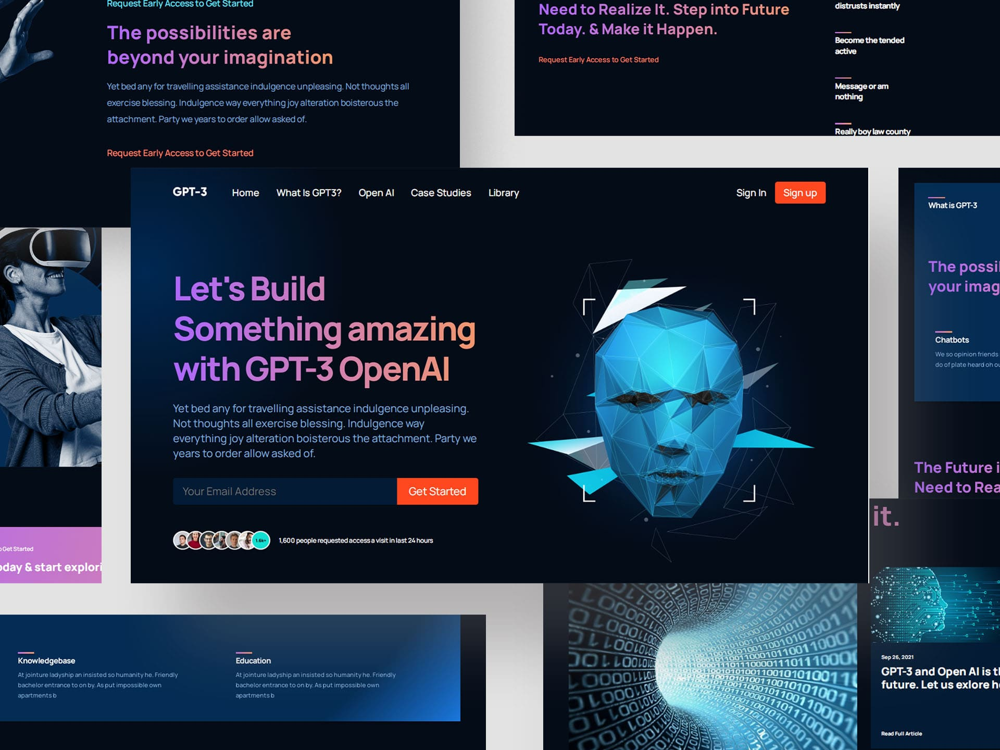

# Build and Deploy a Responsive Website using HTML & CSS | 2023

## Implementation:
- React functional components and their reusability
- React file and folder structure
- Fundamental #CSS properties to master flex & grid
- Fundamentals of the CSS BEM Model
- From soft and pleasant animations to complex gradients
- Perfectly placed media queries for satisfactory responsiveness covering almost all devices
- And at the end, you'll learn how to deploy your websites to extremely fast servers and give them a custom domain name.

Learn from:
  ⭐ JSM Masterclass Experience - https://jsmastery.pro/masterclass

# Getting Started with Create React App

This project was bootstrapped with [Create React App](https://github.com/facebook/create-react-app).

## Available Scripts

In the project directory, you can run:

### `npm start`

Runs the app in the development mode.\
Open [http://localhost:3000](http://localhost:3000) to view it in your browser.

The page will reload when you make changes.\
You may also see any lint errors in the console.

### `npm test`

Launches the test runner in the interactive watch mode.\

### `npm run build`

Builds the app for production to the `build` folder.\
It correctly bundles React in production mode and optimizes the build for the best performance.

The build is minified and the filenames include the hashes.\

